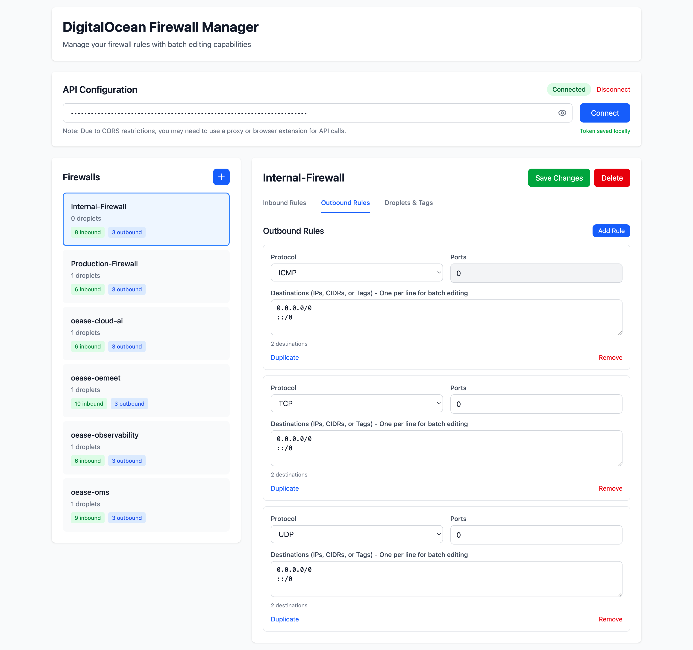

# 🔥 DigitalOcean Firewall Manager

A modern, efficient firewall management interface for DigitalOcean - built by IT professionals, for IT professionals.


## 🚀 Why This Tool?

Managing DigitalOcean firewall rules through the official interface can be tedious, especially when dealing with
multiple IP addresses or complex rule sets. This tool solves that problem with:

- **Batch IP Management**: Add/edit hundreds of IPs at once using simple line-by-line input
- **Persistent Authentication**: Your API token is securely stored locally - no more re-entering it every session
- **Superior UX**: Clean, modern interface with instant feedback and keyboard shortcuts
- **Rule Templates**: Quickly duplicate and modify existing rules
- **Real-time Validation**: See exactly what you're configuring before you save

## ✨ Features

### Core Functionality

- 🔐 **Multi-Token Management** - Store and switch between multiple API tokens for different teams/environments
- 📝 **Batch Rule Editing** - Manage multiple IPs, CIDRs, and tags in one text area
- 🎯 **Smart Rule Management** - Add, duplicate, and remove rules with visual feedback
- 📌 **Rule Notes System** - Add persistent notes to individual firewall rules for documentation
- 💧 **Visual Droplet Selector** - Browse and select droplets with detailed information display
- 🌙 **Dark Mode Support** - Easy on the eyes during those late-night configurations
- ⚡ **Real-time Updates** - Instant success/error notifications for all operations
- 🔄 **Auto-connect** - Automatically connects using saved credentials on page load

### Advanced Features

- **Team Collaboration**: Manage multiple API tokens with custom names (Production, Staging, Team A, etc.)
- **Rule Documentation**: Add notes to each rule explaining purpose, owner, or special conditions
- **Droplet Management**: Visual interface showing droplet details (IP, region, size, status)
- **Multi-source Support**: Configure IPs, CIDR blocks, tags, droplet IDs, and load balancers
- **Rule Positioning**: New rules appear at the top for immediate visibility
- **Protocol Intelligence**: Automatic port field handling based on protocol selection
- **Comprehensive Validation**: Real-time source/destination counting
- **Firewall Overview**: Quick stats showing droplet counts and rule numbers

## 📸 Screenshots



### Main Dashboard

The clean, organized interface shows all your firewalls at a glance with quick stats.

### Batch IP Editing

Add multiple IPs or CIDR blocks with simple line-by-line input:

```
192.168.1.0/24
10.0.0.1
tag:web-servers
droplet:12345678
```

### Rule Management

Easily duplicate, modify, and organize your firewall rules with visual feedback.

## 🛠️ Installation

### Prerequisites

- Node.js 16+ and npm/pnpm/yarn
- Modern browser with localStorage support
- DigitalOcean account with API access

### Quick Start

1. **Clone the repository**

```bash
git clone https://github.com/anxuanzi/digitalocean-firewall-manager.git
cd digitalocean-firewall-manager
```

2. **Install dependencies**

```bash
npm install
# or
pnpm install
# or
yarn install
```

3. **Run your development server**

```bash
npm run dev
# or
pnpm run dev
# or
yarn dev
```

4. **Build for production**

```bash
npm run build
# or
pnpm run build
# or
yarn build
```

## 🔧 Configuration

### API Token Setup

#### Single Token (Quick Start)

1. Generate a Personal Access Token from
   your [DigitalOcean API settings](https://cloud.digitalocean.com/account/api/tokens)
2. Ensure the token has **read and write** permissions for Firewalls
3. Enter the token in the interface - it will be saved locally for future sessions

#### Multiple Tokens (Teams/Environments)

1. Click "Manage Tokens" in the API Configuration panel
2. Add tokens with descriptive names (e.g., "Production", "Staging", "Team DevOps")
3. Switch between tokens instantly using the radio button selection
4. All tokens are securely stored in browser localStorage

## 📚 Usage Guide

### Managing Firewall Rules

#### Adding IPs in Batch

Enter multiple sources/destinations in the text area, one per line:

```
# IP Addresses
192.168.1.1
10.0.0.0/8

# Tags (prefix with 'tag:')
tag:web-servers
tag:database

# Droplet IDs (prefix with 'droplet:')
droplet:12345678

# Load Balancers (prefix with 'lb:')
lb:uuid-here
```

#### Port Configuration

- Single port: `80`
- Multiple ports: `80,443,8080`
- Port range: `3000-4000`
- All ports: `all` or `1-65535`

#### Adding Notes to Rules

1. Click "Add note" below any firewall rule
2. Enter descriptive text (e.g., "Allow traffic from office network", "Temporary access for vendor")
3. Notes are saved automatically in browser storage
4. Notes persist across sessions and are specific to each firewall/rule combination

#### Selecting Droplets

1. Navigate to the "Droplets & Tags" tab
2. Click "Select Droplets" to open the visual selector
3. Browse droplets with details (name, IP, region, size, status)
4. Check/uncheck droplets to assign to the firewall
5. Click "Apply Selection" to save changes

#### Keyboard Shortcuts

- `Enter` in token field: Connect to API
- `Escape` in note editor: Cancel editing
- Click outside modal: Close droplet selector

### Best Practices

1. **Organize with Notes**: Document each rule's purpose using the notes feature
2. **Use Multiple Tokens**: Separate production and development environments with different tokens
3. **Group Similar Rules**: Use the duplicate feature to quickly create similar rules
4. **Use Tags**: Leverage DigitalOcean tags for dynamic firewall management
5. **Test First**: Create test rules with specific IPs before applying broad CIDR blocks
6. **Regular Backups**: Export your firewall configurations regularly
7. **Visual Droplet Selection**: Use the droplet selector to avoid manual ID entry errors

## 🔒 Security Considerations

- **Token Storage**: API tokens are stored in browser localStorage (client-side only)
- **Multiple Token Security**: Each token is stored separately with a unique identifier
- **Clear on Shared Computers**: Use the "Disconnect" button and token management to remove stored tokens
- **Token Permissions**: Use tokens with minimal required permissions
- **Rule Notes Privacy**: Notes are stored locally and never sent to external servers
- **Browser Storage**: All sensitive data remains in your browser's localStorage

### Development Guidelines

- Follow Vue 3 Composition API best practices
- Use TypeScript for type safety
- Maintain the existing code style
- Add comments for complex logic
- Test with multiple firewall configurations

## 📝 License

This project is licensed under the MIT License.

## 🙏 Acknowledgments

- Built with [Vue.js 3](https://vuejs.org/) and [TypeScript](https://www.typescriptlang.org/)
- Styled with [Tailwind CSS 4](https://tailwindcss.com/)
- Icons from [Heroicons](https://heroicons.com/)
- Inspired by the needs of DevOps engineers and system administrators worldwide

---

**Built with ❤️by [FantasticTony](https://ftan.dev/) for the DevOps Community**

If this tool saves you time, consider giving it a ⭐ on GitHub!
